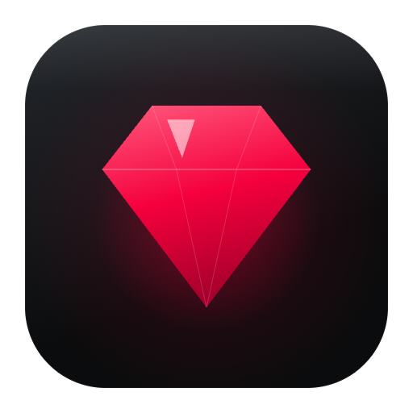
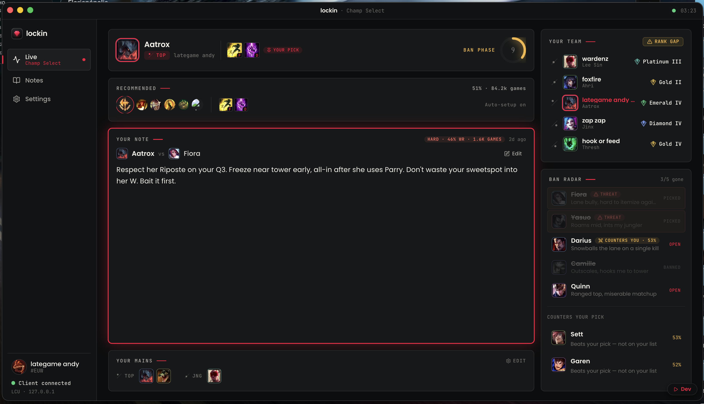
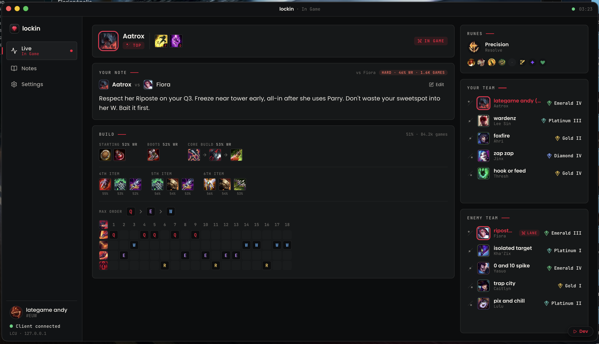
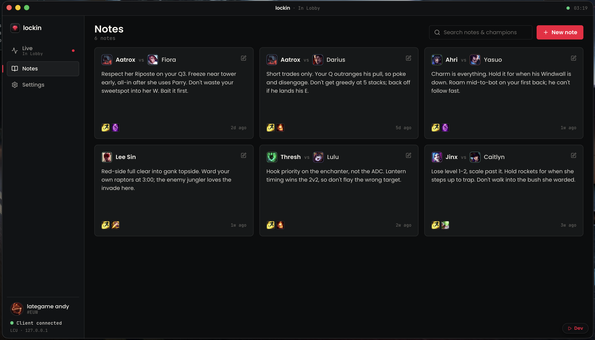
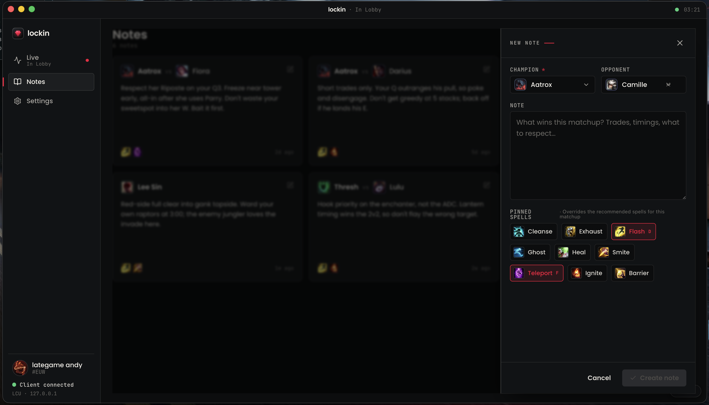
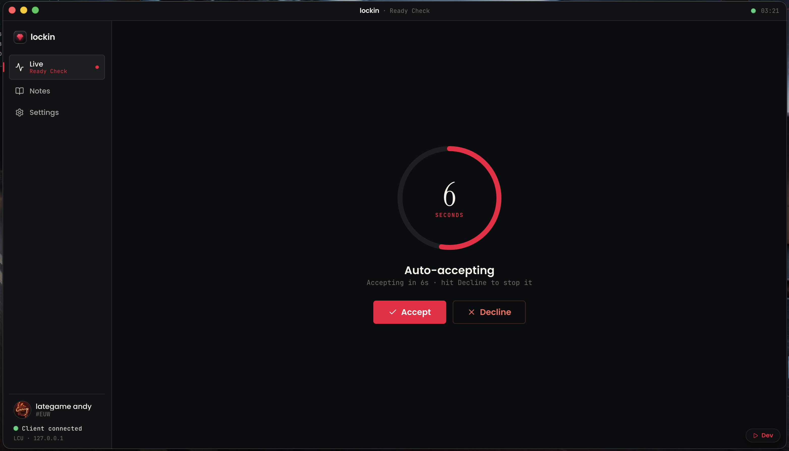
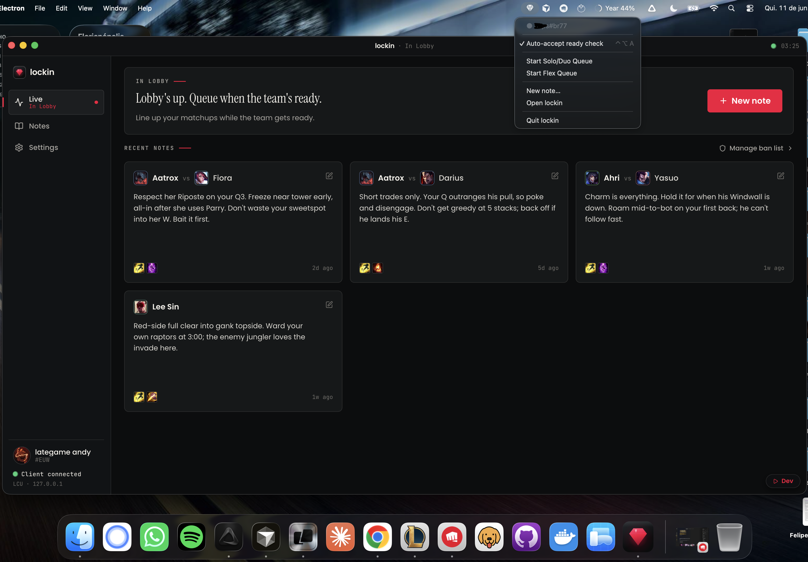
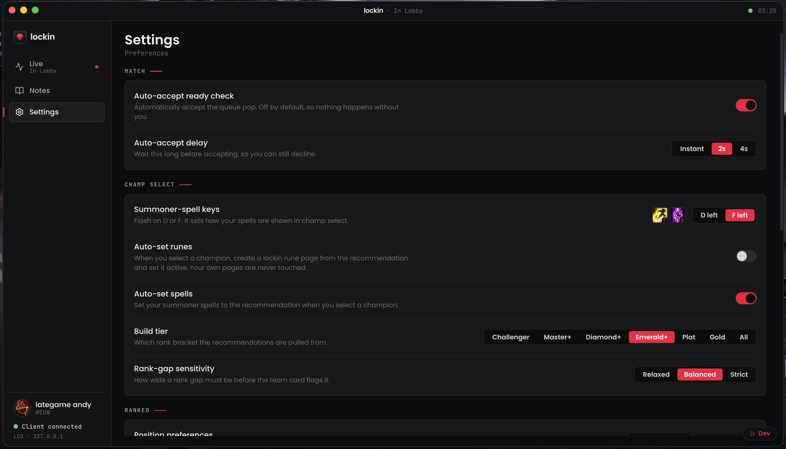
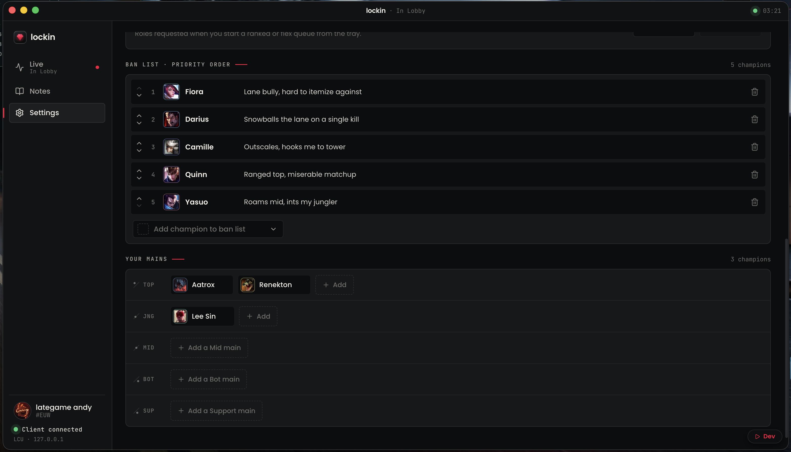
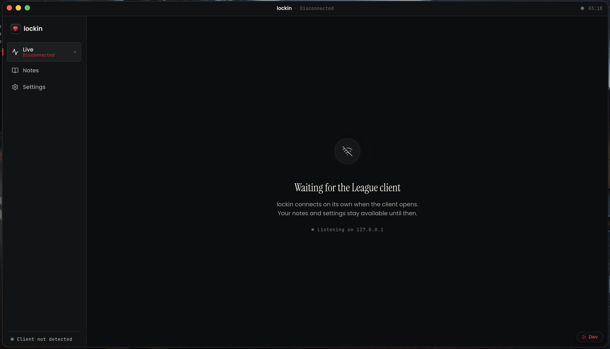

<div align="center">



# lockin

**The League companion that does its homework before you lock in.**

Matchup notes, ban planning, and build guidance — live in Champ Select, on your desktop.

[](https://github.com/feliperodriguess/lockin/releases/latest)
[](https://github.com/feliperodriguess/lockin/releases)




</div>

---

lockin is an unofficial desktop companion for the League client. It sits quietly next to the client, notices what's happening — lobby, queue pop, Champ Select, in game — and puts the right information in front of you at the right moment. You write a note once about a matchup that beat you; the next time you face it, the note is already on screen.

Everything is local. No account, no login, no telemetry, no backend. Your notes and settings live on your machine.

## What it does

### Champ Select, with the prep done

The moment you're in Champ Select, lockin shows your matchup note for the lane you're facing, the recommended summoner spells and runes for your pick (with win rate and sample size), both teams' ranks with a rank-gap warning, and a **ban radar** that tracks your personal perma-bans — who's already banned, who's been picked, and who's still open. It also flags enemy champions that statistically counter your pick.

If you enable auto-setup, lockin applies the recommended runes and summoner spells when you pick — writing only to its own lockin-owned rune page. Your pages are never touched.

### An In-Game screen that remembers the plan



Once the game starts, lockin switches to an In-Game view: your matchup note stays up, alongside the full build path (starting items, boots, core items by win rate), the skill max order, your runes, and both teams with their ranks.

### Notes that come back when they matter

<div align="center">

</div>

Notes are per-matchup — *your* champion into *their* champion. Write what wins the lane: trades, timings, what to respect. You can pin summoner spells to a note to override the recommendation for that specific matchup (Aatrox into Camille might want Teleport where the stats say Ignite).

<div align="center">

</div>

### Queue pop, handled

<div align="center">

</div>

Opt-in auto-accept takes the ready check for you, with a configurable delay (instant / 2s / 4s) and a big Decline button while it counts down — you always get the final word. It's off by default, and it never chains into anything else.

### A tray that earns its spot

<div align="center">

</div>

From the menu bar / system tray: toggle auto-accept, start a Solo/Duo or Flex queue (one explicit click — never automated), jot a new note, or jump back into the app.

### Tuned to how you play

<div align="center">

<br /><br />

</div>

Set your summoner-spell key order (Flash on D or F — the eternal war), the rank bracket recommendations are pulled from (Challenger down to All), rank-gap sensitivity, your ban list in priority order, and your mains per role so Champ Select knows who you actually play.

And when the client isn't running, lockin just waits — your notes and settings stay available:

<div align="center">

</div>

## Download

Grab the latest build from [**Releases**](https://github.com/feliperodriguess/lockin/releases/latest):

| Platform | File |
| --- | --- |
| macOS (Apple silicon) | `lockin-{version}-arm64.dmg` |
| macOS (Intel) | `lockin-{version}-x64.dmg` |
| Windows | `lockin-{version}-setup.exe` |

> [!NOTE]
> Builds are not code-signed (no Apple Developer / Windows certificate).
> **macOS** will report the app as damaged or from an unidentified developer on first launch. Clear the quarantine flag and it runs normally:
> ```sh
> xattr -cr /Applications/lockin.app
> ```
> **Windows** SmartScreen may warn on first run — choose *More info → Run anyway*.

## How it works

```
┌─────────────────────────── lockin (Electron) ───────────────────────────┐
│                                                                          │
│  main process                preload              renderer               │
│  ─ LCU websocket + REST      ─ typed              ─ React 19 UI          │
│    (league-connect)            contextBridge      ─ TanStack Router      │
│  ─ Data Dragon catalog         (window.api)       ─ TanStack Query       │
│  ─ OP.GG build data                               ─ Tailwind CSS v4      │
│  ─ electron-store                                                        │
│  ─ native tray                                                           │
└──────────────────────────────────────────────────────────────────────────┘
        │                │                  │
        ▼                ▼                  ▼
  League client     Riot Data Dragon    OP.GG MCP
  (local LCU API)   (champ/item/spell   (runes, items, skill
                     icons + catalog)    order — disk-cached)
```

- **All outside access lives in the main process.** The renderer is pure UI behind a typed IPC bridge — it never touches the network or the LCU directly.
- **Live client state is pushed, not polled** — gameflow phase, Champ Select session, ready check, and your summoner arrive over the LCU websocket and flow into React through a single provider.
- **Build recommendations** come from OP.GG (one keyless read, cached on disk). If the fetch fails, the build section simply hides — nothing crashes.
- **User data is yours**: notes and settings are JSON on disk via `electron-store`.

## Fair play, by design

lockin reads the local **League Client (LCU) API only** — never the game process, never game memory.

The only writes it ever performs are limited and **opt-in**:

- Accept the ready check (off by default, with a visible countdown + Decline).
- Apply runes and summoner spells in Champ Select (off by default; runes only ever touch a lockin-owned page).
- Create a lobby / start matchmaking from the tray — on an explicit click, never looped, never chained with auto-accept.

**No auto-pick. No auto-ban. No auto-dodge. Ever.**

## Tech stack

| Layer | Tech |
| --- | --- |
| Shell | [Electron](https://www.electronjs.org/) + [electron-vite](https://electron-vite.org/) |
| UI | [React 19](https://react.dev/), [TanStack Router](https://tanstack.com/router) (memory history), [TanStack Query](https://tanstack.com/query) |
| Styling | [Tailwind CSS v4](https://tailwindcss.com/) (CSS-first config), [shadcn/ui](https://ui.shadcn.com/) primitives, [motion](https://motion.dev/) |
| League client | [league-connect](https://github.com/matsjla/league-connect) (LCU websocket + REST) |
| Data | Riot Data Dragon (static catalog) · OP.GG (build recommendations) · [electron-store](https://github.com/sindresorhus/electron-store) (persistence) |
| Tooling | TypeScript, [Biome](https://biomejs.dev/), [Vitest](https://vitest.dev/), pnpm |

## Development

```sh
pnpm install      # install dependencies
pnpm dev          # run the app with renderer HMR
pnpm typecheck    # tsc --noEmit
pnpm test         # vitest
pnpm format       # biome — lint + format + organize imports
pnpm build:mac    # package a macOS .dmg locally
pnpm build:win    # package a Windows installer locally
```

The design system lives in `src/renderer/src/global.css`; `PRD.md` is the source of truth for behavior, data models, and the IPC contract.

### Releasing

Releases are automated. Bump `version` in `package.json`, land it on `main`, and GitHub Actions builds the macOS dmgs and Windows installer, tags `v{version}`, and publishes a GitHub Release with the artifacts attached.

## Disclaimer

lockin is an unofficial fan project. It isn't endorsed by Riot Games and doesn't reflect the views or opinions of Riot Games or anyone officially involved in producing or managing Riot Games properties. Riot Games and all associated properties are trademarks or registered trademarks of Riot Games, Inc.
